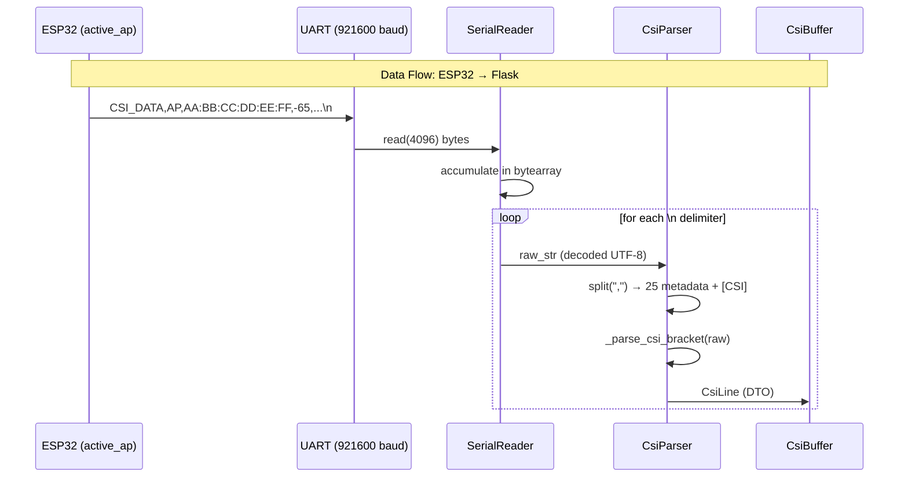
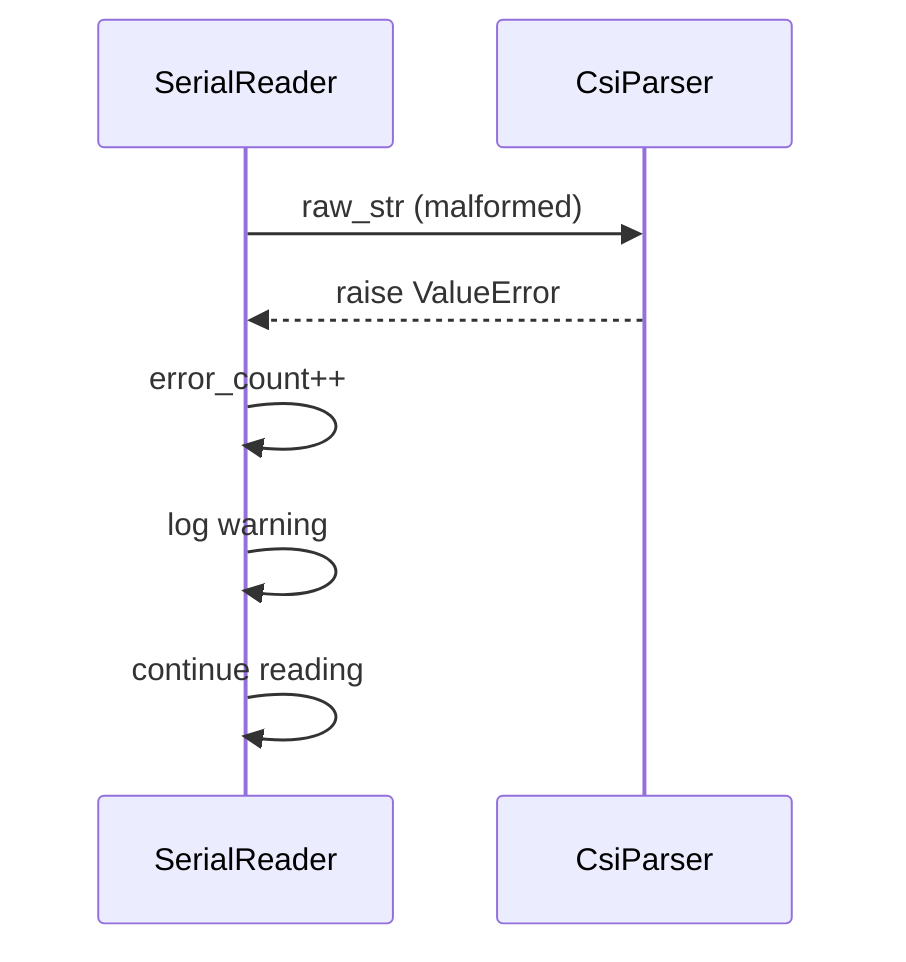
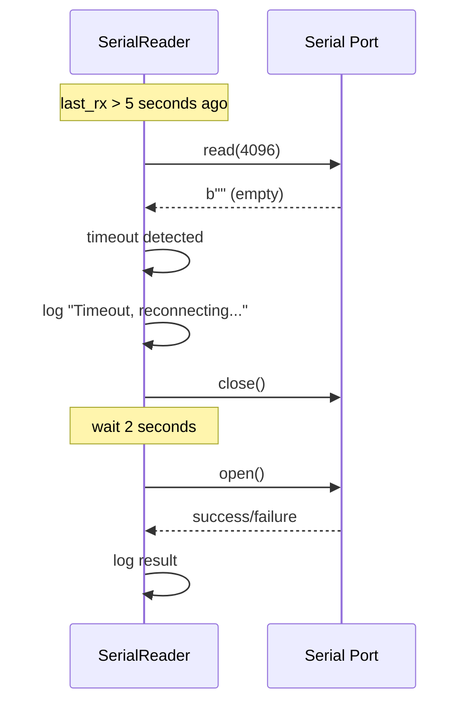
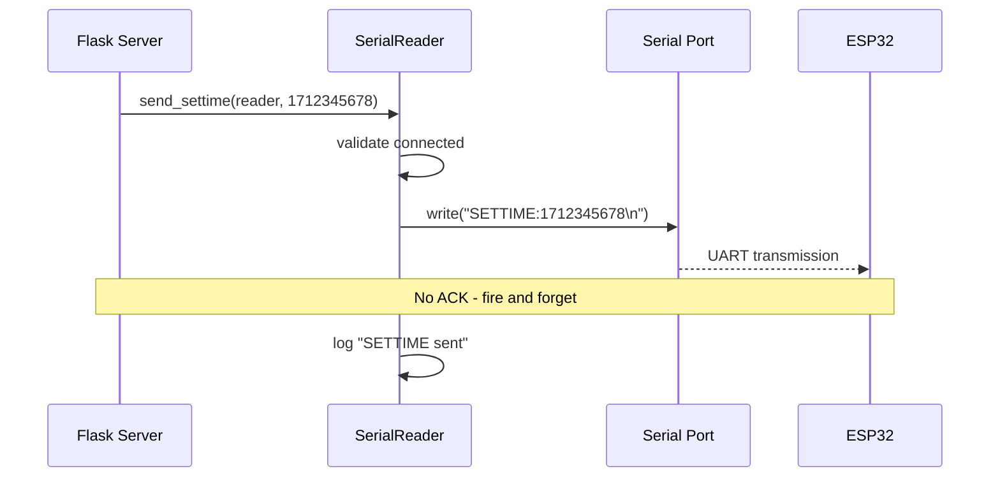

# Sequence Diagram — CSI Data Flow

## Main Flow: ESP32 → Flask

```mermaid
sequenceDiagram
    participant ESP32 as ESP32 (active_ap)
    participant UART as UART (921600 baud)
    participant Reader as SerialReader
    participant Parser as CsiParser
    participant Buffer as CsiBuffer

    Note over ESP32,Buffer: Data Flow: ESP32 → Flask

    ESP32->>UART: CSI_DATA,AP,AA:BB:CC:DD:EE:FF,-65,...\n
    UART->>Reader: read(4096) bytes
    Reader->>Reader: accumulate in bytearray
    loop for each \n delimiter
        Reader->>Parser: raw_str (decoded UTF-8)
        Parser->>Parser: split(",") → 25 metadata + [CSI]
        Parser->>Parser: _parse_csi_bracket(raw)
        Parser->>Buffer: CsiLine (DTO)
    end
```

## Error Handling: Malformed Line

```mermaid
sequenceDiagram
    participant Reader as SerialReader
    participant Parser as CsiParser

    Reader->>Parser: raw_str (malformed)
    Parser-->>Reader: raise ValueError
    Reader->>Reader: error_count++
    Reader->>Reader: log warning
    Reader->>Reader: continue reading
```

## Error Handling: Timeout and Reconnect

```mermaid
sequenceDiagram
    participant Reader as SerialReader
    participant Port as Serial Port

    Note over Reader: last_rx > 5 seconds ago
    Reader->>Port: read(4096)
    Port-->>Reader: b"" (empty)
    Reader->>Reader: timeout detected
    Reader->>Reader: log "Timeout, reconnecting..."
    Reader->>Port: close()
    Note over Reader: wait 2 seconds
    Reader->>Port: open()
    Port-->>Reader: success/failure
    Reader->>Reader: log result
```

## Command Flow: Host → ESP32

```mermaid
sequenceDiagram
    participant Host as Flask Server
    participant Reader as SerialReader
    participant Port as Serial Port
    participant ESP32 as ESP32

    Host->>Reader: send_settime(reader, 1712345678)
    Reader->>Reader: validate connected
    Reader->>Port: write("SETTIME:1712345678\n")
    Port-->>ESP32: UART transmission
    Note over Host,ESP32: No ACK - fire and forget
    Reader->>Reader: log "SETTIME sent"
```
