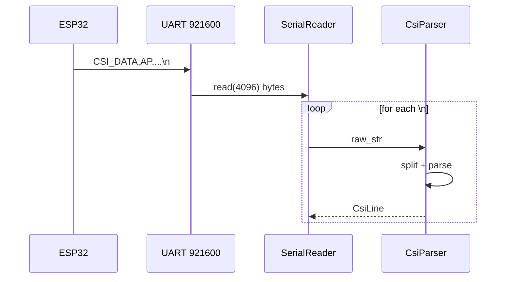
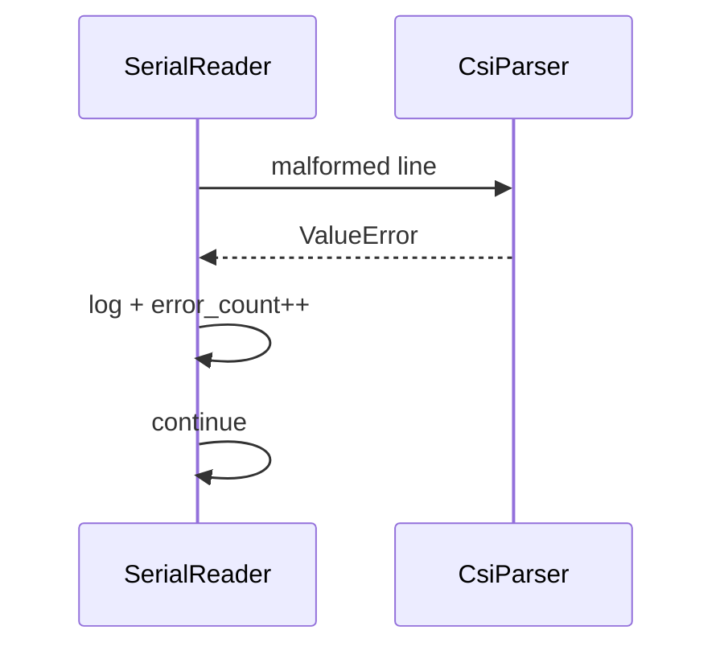
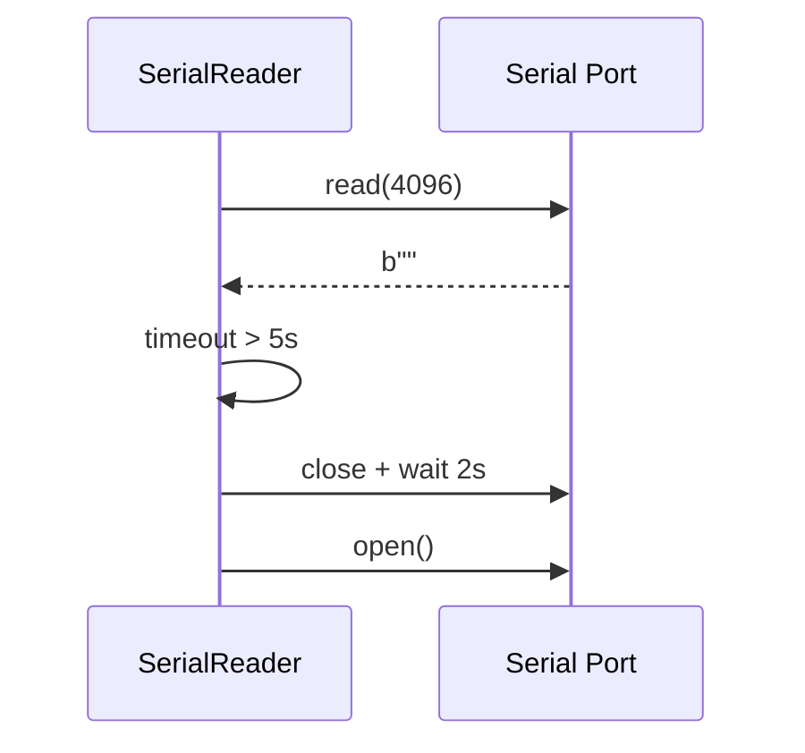
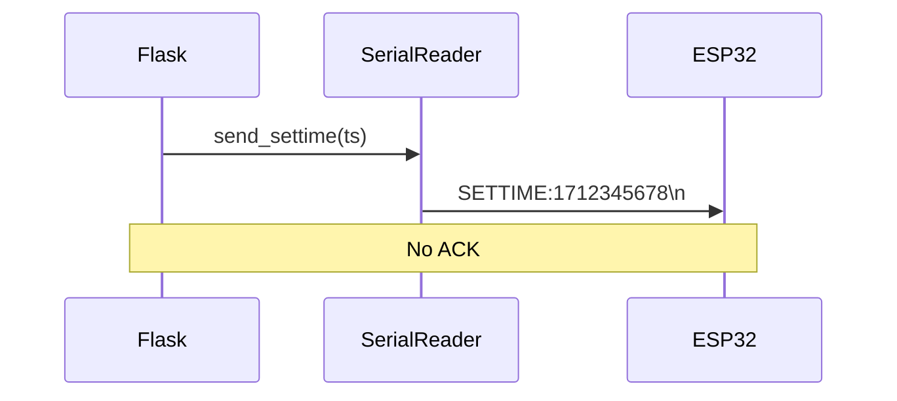

# Sequence Diagrams — CSI Data Flow

## Main Flow: ESP32 → Flask

```mermaid
sequenceDiagram
    participant ESP32 as ESP32
    participant UART as UART 921600
    participant Reader as SerialReader
    participant Parser as CsiParser

    ESP32->>UART: CSI_DATA,AP,...\n
    UART->>Reader: read(4096) bytes
    loop for each \n
        Reader->>Parser: raw_str
        Parser->>Parser: split + parse
        Parser-->>Reader: CsiLine
    end
```

## Error Handling

```mermaid
sequenceDiagram
    participant Reader as SerialReader
    participant Parser as CsiParser

    Reader->>Parser: malformed line
    Parser-->>Reader: ValueError
    Reader->>Reader: log + error_count++
    Reader->>Reader: continue
```

## Timeout & Reconnect

```mermaid
sequenceDiagram
    participant Reader as SerialReader
    participant Port as Serial Port

    Reader->>Port: read(4096)
    Port-->>Reader: b""
    Reader->>Reader: timeout > 5s
    Reader->>Port: close + wait 2s
    Reader->>Port: open()
```

## Commands

```mermaid
sequenceDiagram
    participant Host as Flask
    participant Reader as SerialReader
    participant ESP32 as ESP32

    Host->>Reader: send_settime(ts)
    Reader->>ESP32: SETTIME:1712345678\n
    Note over Host,ESP32: No ACK
```
