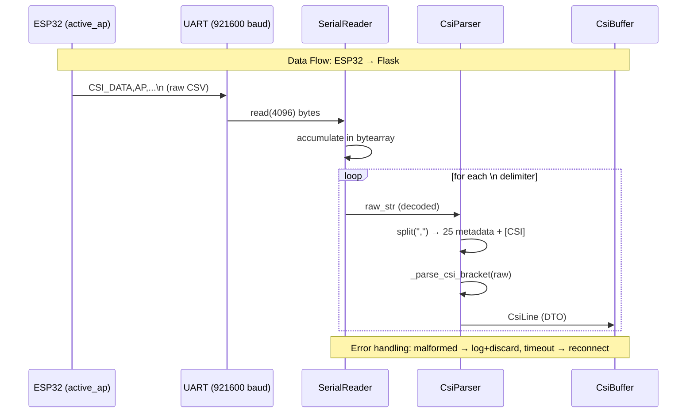

## ⚡ Do This First: Load Agent Profile

Before reading anything else, load the **implementer** profile:

```
/ad-hoc-profile-load
```

This activates the identity, governance scope, and initialization declaration for this work package.

---

## Objective

Implement the foundation of the ESP32-Flask communication interface: the data models and CSV parser. This is WP01 of 3 — it has no dependencies and everything else builds on it.

---

## Context

This is a research/academic project: CSI (Channel State Information) capture from ESP32 WiFi firmware. The ESP32 transmits CSI data over UART at 921600 baud. The data arrives as CSV-like lines prefixed with `CSI_DATA`. The 26th field contains interleaved I/Q values in bracket+space format (e.g., `[12 -5 34 -8]`), NOT comma-separated.

The working contracts already exist as prototypes in `kitty-specs/interfaz-comunicacion-esp32-flask-01KWZKM3/contracts/`. These need to be turned into production-quality code under `src/flask_serial/`.

### Architecture

Layered architecture with Component-Based style:

```
Layer 1 (Serial) ──> Layer 2 (Parser) ──> Layer 3 (Processing) ──> Layer 4 (API)
       reader.py          parser.py          (future)                  (future)
                          models.py
```

Key patterns in use:
- **DTO**: `CsiLine` dataclass transports parsed data between layers without coupling
- **Adapter**: Parser adapts the raw ESP32 serial protocol to Python objects
- **Repository**: Abstraction over data source (serial, file, or mock)

---

## Subtasks

### T001 — Create `src/flask_serial/` package structure

**Purpose**: Set up the Python package directory tree with proper `__init__.py` files.

**Files**:
- `src/flask_serial/__init__.py`
- `tests/__init__.py`
- `pyproject.toml` or `setup.cfg` for installable package

**Details**:
- The project root is the repo root (CSI-ESP/). Source lives under `src/`.
- `__init__.py` in `flask_serial/` should export key symbols for convenience:
  ```python
  from flask_serial.models import CsiLine, Role
  from flask_serial.parser import parse_line
  ```
- Create `src/flask_serial/py.typed` for PEP 561 compliance.
- `tests/__init__.py` can be empty.
- The package must be importable as `from flask_serial import ...` — if using `pyproject.toml`, set `[project] name = "flask-serial"` and `[tool.setuptools.packages.find] where = ["src"]`.

**Validation**:
- [ ] `python -c "from flask_serial import CsiLine, Role, parse_line"` succeeds from repo root
- [ ] `pytest --collect-only tests/` discovers test files

---

### T002 — Implement `models.py`

**Purpose**: Define `Role(Enum)` and `CsiLine(@dataclass)` as the DTOs for the system.

**File**: `src/flask_serial/models.py`

**Specification** (from `data-model.md`):

| Field | Type | CSV Pos | Notes |
|-------|------|---------|-------|
| `type` | `str` | 1 | Always `"CSI_DATA"` |
| `role` | `Optional[Role]` | 2 | `AP`, `PASSIVE`, `STA` |
| `mac` | `Optional[str]` | 3 | `XX:XX:XX:XX:XX:XX` format |
| `rssi` | `Optional[int]` | 4 | -90 to -20 dBm |
| `rate` | `Optional[int]` | 5 | PHY rate index |
| `sig_mode` | `Optional[int]` | 6 | 0=non-HT, 1=HT, 3=VHT |
| `mcs` | `Optional[int]` | 7 | 0-76 |
| `bandwidth` | `Optional[int]` | 8 | 0=20MHz, 1=40MHz |
| `smoothing` | `Optional[bool]` | 9 | |
| `not_sounding` | `Optional[bool]` | 10 | |
| `aggregation` | `Optional[bool]` | 11 | 0=MPDU, 1=AMPDU |
| `stbc` | `Optional[bool]` | 12 | |
| `fec_coding` | `Optional[bool]` | 13 | LDPC |
| `sgi` | `Optional[bool]` | 14 | Short Guard Interval |
| `noise_floor` | `Optional[int]` | 15 | dBm |
| `ampdu_cnt` | `Optional[int]` | 16 | AMPDU subframes |
| `channel` | `Optional[int]` | 17 | 1-13 |
| `secondary_channel` | `Optional[int]` | 18 | 0=none, 1=above, 2=below |
| `local_timestamp` | `Optional[int]` | 19 | ESP32 microseconds |
| `ant` | `Optional[int]` | 20 | 0=ANT0, 1=ANT1 |
| `sig_len` | `Optional[int]` | 21 | Packet bytes |
| `rx_state` | `Optional[int]` | 22 | 0=ok, !=0=error |
| `real_time_set` | `Optional[bool]` | 23 | Clock synced |
| `real_timestamp` | `Optional[float]` | 24 | Seconds (steady_clock) |
| `len` | `Optional[int]` | 25 | CSI data buffer length |
| `csi_data` | `list[int]` | 26+ | I/Q interleaved values |

**Implementation details**:
- Use `from __future__ import annotations` for forward references
- `Role` enum with values `AP = "AP"`, `PASSIVE = "PASSIVE"`, `STA = "STA"`
- `CsiLine` as `@dataclass` with default `None` for all optional fields and `field(default_factory=list)` for `csi_data`
- All fields optional except `type` (default `"CSI_DATA"`) — this allows constructing partial objects during testing
- Since `len` shadows the builtin, be careful: reference as `self.len` is fine but document it

**Validation**:
- [ ] `Role.AP.value == "AP"`, `Role.PASSIVE.value == "PASSIVE"`
- [ ] `CsiLine(role=Role.AP, mac="AA:BB:CC:DD:EE:FF")` creates valid instance
- [ ] `CsiLine().csi_data == []` (empty list, not None)

---

### T003 — Implement `parser.py`

**Purpose**: Parse raw CSV lines into `CsiLine` objects. Handle the bracket+space format for CSI data.

**File**: `src/flask_serial/parser.py`

**Input format**:
```
CSI_DATA,<role>,<mac>,<rssi>,<rate>,<sig_mode>,<mcs>,<bandwidth>,<smoothing>,<not_sounding>,<aggregation>,<stbc>,<fec_coding>,<sgi>,<noise_floor>,<ampdu_cnt>,<channel>,<secondary_channel>,<local_timestamp>,<ant>,<sig_len>,<rx_state>,<real_time_set>,<real_timestamp>,<len>,[<I0> <Q0> <I1> <Q1> ...]
```

**Key rules**:
1. First 25 fields are comma-separated metadata
2. Field 26 (the CSI data) is delimited by `[...]` with **space-separated integers** inside
3. Line must start with `CSI_DATA` prefix
4. Minimum 26 fields after split by comma
5. Empty lines are silently ignored (not errors)
6. Lines starting with wrong prefix raise `ValueError`
7. Lines with < 26 fields raise `ValueError`

**Functions to implement**:

```python
def parse_line(raw: str) -> CsiLine:
    """
    Parse a single raw CSV line into a CsiLine dataclass.
    Raises ValueError on malformed input.
    """
    ...

def _parse_csi_bracket(raw: str) -> list[int]:
    """
    Parse the bracketed CSI data field.
    Input: "[12 -5 34 -8 0 127 -64 33]"
    Output: [12, -5, 34, -8, 0, 127, -64, 33]
    Empty bracket "[]" returns [].
    Raises ValueError if brackets missing.
    """
    ...

def _int(v: str) -> Optional[int]: ...
def _float(v: str) -> Optional[float]: ...
def _bool(v: str) -> Optional[bool]: ...
```

**Helper details**:
- `_int("")` returns `None`, `_int("-65")` returns `-65`
- `_float("")` returns `None`, `_float("1712345678.500")` returns `1712345678.500`
- `_bool("1")` returns `True`, `_bool("0")` returns `False`, `_bool("")` returns `None`
- Use `try/except (ValueError, TypeError)` in all helpers

**Edge cases for `_parse_csi_bracket`**:
- `"[12 -5 34 -8]"` → `[12, -5, 34, -8]`
- `"[]"` → `[]`
- `"  [12 34]  "` → strip whitespace first → `[12, 34]`
- `"12 -5 34"` (no brackets) → `ValueError`
- `"[12, -5, 34]"` (comma inside brackets) → `ValueError` on `int("12,")`

**Validation**:
- [ ] `parse_line("CSI_DATA,AP,AA:BB:CC:DD:EE:FF,-65,1,0,1,1,0,0,0,0,-90,0,6,0,12345678,0,100,0,1,1712345678.500,128,[12 -5 34 -8]")` returns valid `CsiLine` with correct field values
- [ ] `parse_line("CSI_DATA,AP,AA:BB:CC:DD:EE:FF,-65,1,0,1,1,0,0,0,0,-90,0,6,0,12345678,0,100,0,1,1712345678.500,128,[]")` returns `CsiLine` with `csi_data=[]`
- [ ] `parse_line("BAD_DATA,...")` raises `ValueError: Invalid prefix`
- [ ] `parse_line("CSI_DATA,AP")` raises `ValueError: Expected >=26 fields`
- [ ] Empty string after strip → skips (caller handles this, not parser)

---

### T004 — Write `test_parser.py`

**Purpose**: Comprehensive pytest suite for the parser module.

**File**: `tests/test_parser.py`

**Test cases**:

1. `test_parse_valid_line` — Full valid line with all fields, verify every field value
2. `test_parse_empty_csi` — Valid line with `[]` CSI data
3. `test_parse_invalid_prefix` — Line starting with `BAD_DATA` raises ValueError
4. `test_parse_too_few_fields` — Line with < 26 fields raises ValueError
5. `test_parse_missing_brackets` — CSI field without brackets raises ValueError
6. `test_parse_role_sta` — Line with role=STA
7. `test_parse_role_passive` — Line with role=PASSIVE
8. `test_parse_csi_single_value` — Bracketed single value `[42]`
9. `test_parse_csi_negative_values` — Negative I/Q values
10. `test_parse_csi_whitespace` — Extra whitespace in brackets `[  12  -5  ]`

**Pattern**: Import from `flask_serial.parser` and `flask_serial.models`.

```python
import pytest
from flask_serial.parser import parse_line
from flask_serial.models import Role

def test_parse_valid_line():
    raw = "CSI_DATA,AP,AA:BB:CC:DD:EE:FF,-65,1,0,1,1,0,0,0,0,-90,0,6,0,12345678,0,100,0,1,1712345678.500,128,[12 -5 34 -8 0 127 -64 33]"
    line = parse_line(raw)
    assert line.type == "CSI_DATA"
    assert line.role == Role.AP
    assert line.mac == "AA:BB:CC:DD:EE:FF"
    assert line.rssi == -65
    assert line.channel == 6
    assert line.real_timestamp == 1712345678.500
    assert line.len == 128
    assert line.csi_data == [12, -5, 34, -8, 0, 127, -64, 33]
```

**Validation**:
- [ ] `pytest tests/test_parser.py -v` — all tests pass
- [ ] Edge cases covered: empty, negative, whitespace, single value, empty brackets

---

### T005 — Write DD-002 Protocol Specification

**Purpose**: Create a formal specification document describing the CSI line protocol format.

**File**: `kitty-specs/interfaz-comunicacion-esp32-flask-01KWZKM3/contracts/README.md`

**Content**:
- Full line format with field-by-field documentation (table)
- Role identification (AP, PASSIVE, STA)
- CSI data encoding (bracket+space, I/Q interleaved, int8)
- Delimiter rules (comma for metadata, space inside brackets, `\n` as line terminator)
- Physical layer parameters (921600 baud, 8N1, 3.3V TTL)
- Control commands (SETTIME, RESET format)
- Error scenarios and handling rules
- Reference to firmware source: `_components/csi_component.h`

---

### T013 — Write DD-001 Sequence Diagram

**Purpose**: Document the data flow from ESP32 through UART to the Flask server.

**File**: `kitty-specs/interfaz-comunicacion-esp32-flask-01KWZKM3/contracts/sequence-diagram.md`

**Content**: Use Mermaid sequence diagram:



Include also a section explaining the error handling flow (malformed line, timeout, disconnection).

---

## Definition of Done

- [ ] `src/flask_serial/__init__.py`, `models.py`, `parser.py` created and importable
- [ ] `tests/test_parser.py` with ≥8 test cases, all passing
- [ ] `contracts/README.md` written with full protocol specification
- [ ] `contracts/sequence-diagram.md` written with Mermaid diagram
- [ ] `pytest tests/test_parser.py -v` passes
- [ ] `python -c "from flask_serial import CsiLine, Role, parse_line; parse_line('...')"` works

## Risks

- The CSI field format in the firmware is bracket+space NOT comma — parsers expecting comma will break on `[12 -5 34]`
- Field order or count changes in upstream firmware would break the parser (out of scope for this WP, but worth noting)

## Reviewer Guidance

Verify:
1. `_parse_csi_bracket` correctly handles spaces, negatives, and empty brackets
2. All CsiLine fields are Optional (None-safe) for malformed CSV fields
3. No hardcoded assumptions about specific CSV field values beyond the fixed `CSI_DATA` prefix
4. Tests cover the 5 error scenarios from FR-006 (malformed lines, empty, wrong prefix, too few fields, missing brackets)
